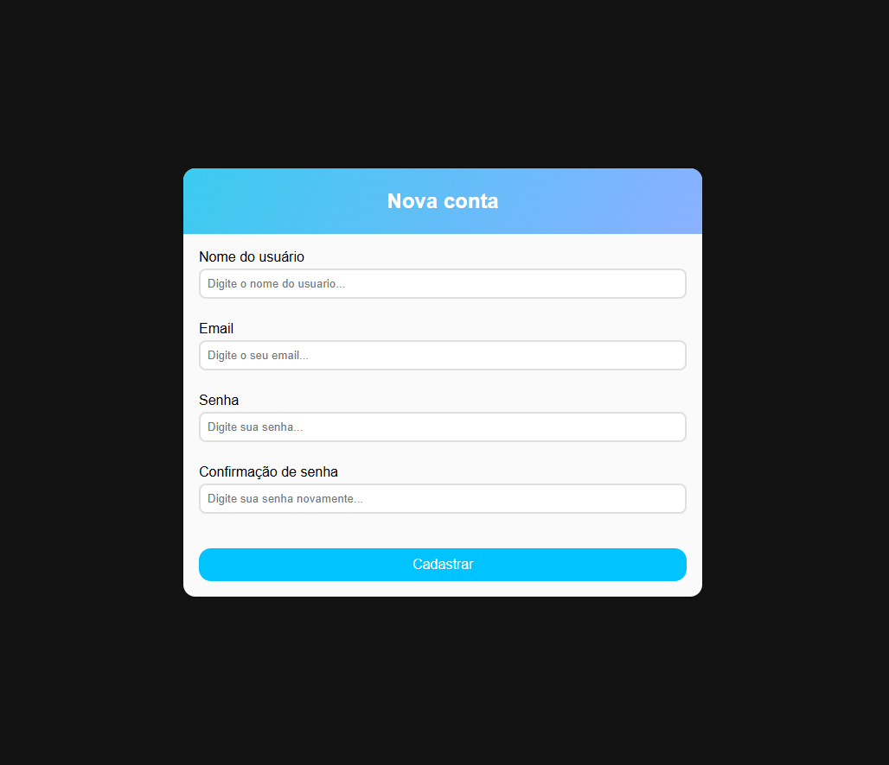
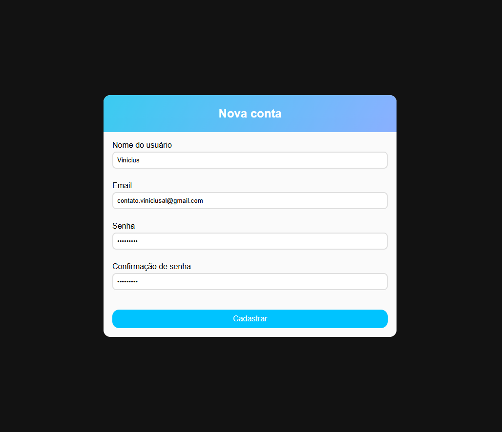
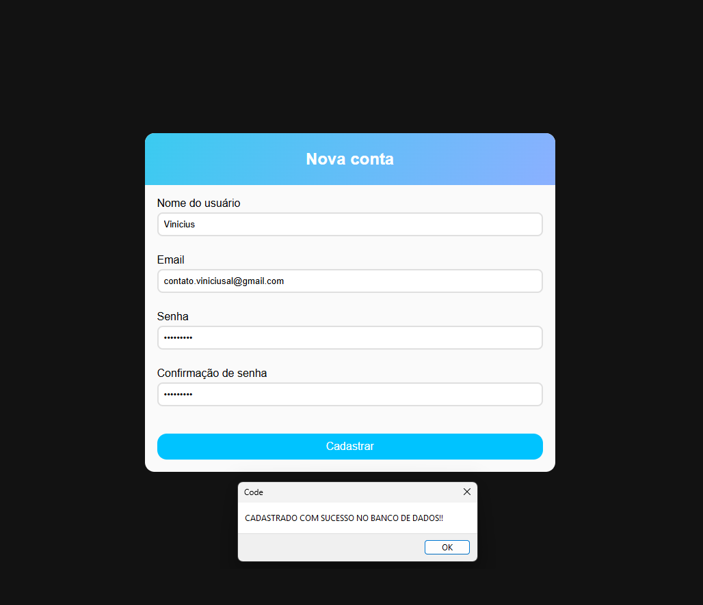
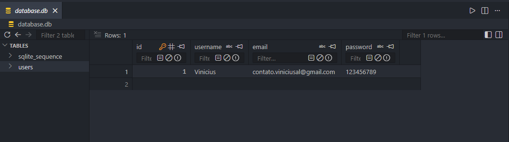
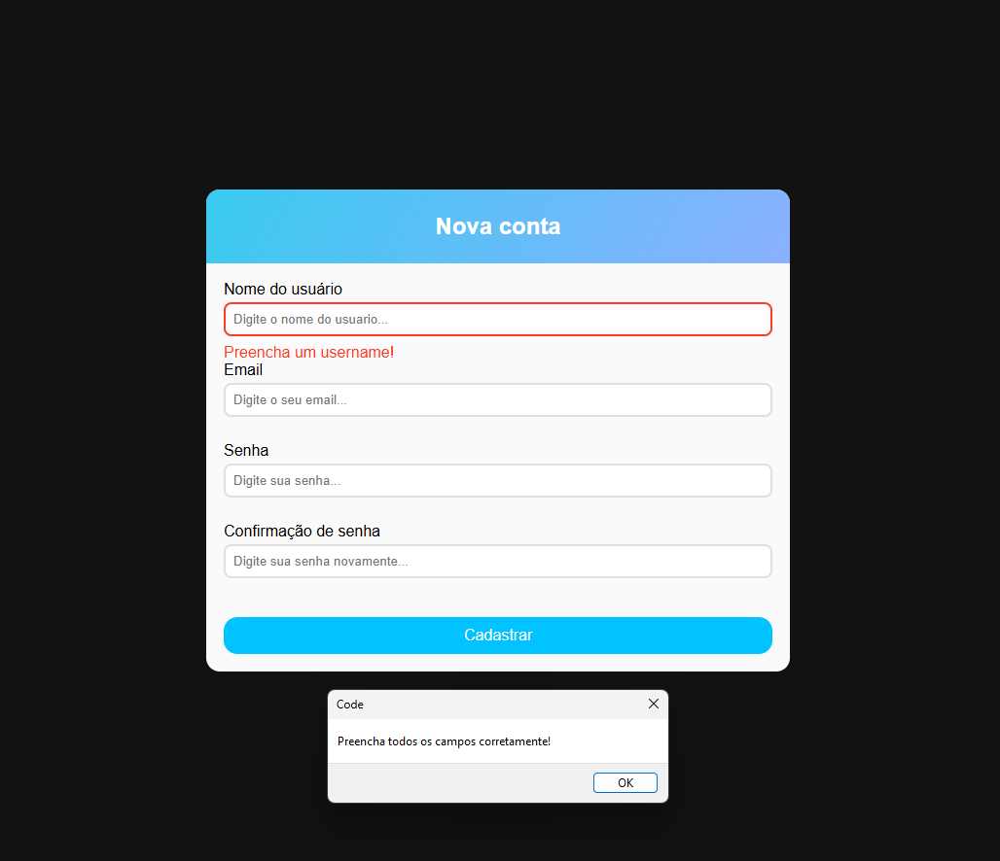

# 📋 Cadastro de Usuário

Sistema de cadastro de usuários desenvolvido com HTML, CSS, JavaScript, Node.js e SQLite. O projeto realiza validação de dados no frontend e armazenamento das informações em um banco de dados relacional local.

## 🚀 Tecnologias Utilizadas

- HTML5
- CSS3
- JavaScript
- Node.js
- Express
- SQLite


## ✨ Funcionalidades

- Cadastro de usuários
- Validação de campos
- Armazenamento em SQLite
- Tratamento de erros
- Integração Frontend + Backend


## 🎯 Aprendizados

Neste projeto pratiquei:

- Manipulação do DOM
- Requisições HTTP
- Criação de APIs com Express
- Integração com banco SQLite
- Tratamento de erros

## ⚙️ Como Executar

### Instalar dependências

```bash
npm install
```

### Iniciar o servidor

```bash
node server.js
```

### Executar o frontend

Abra o arquivo `index.html` utilizando a extensão **Live Server**.

## 📁 Estrutura do Projeto

```text
📦 cadastro-usuarios
├── images/
├── index.html
├── style.css
├── script.js
├── server.js
├── package.json
├── package-lock.json
└── README.md
```

## 📸 Demonstração

### Tela Inicial



### Formulário Preenchido



### Cadastro Realizado



### Banco de Dados



### Tratamento de Erros



## 📚 Projeto Acadêmico

Desenvolvido para fins educacionais, demonstrando a integração entre Frontend, Backend e Banco de Dados.